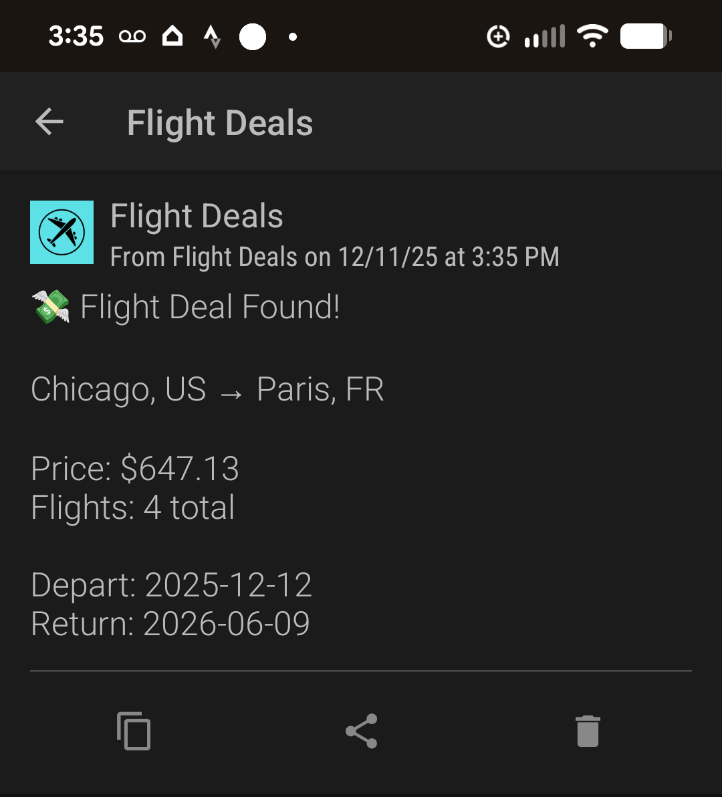

# ☁︎ ✈︎ Flight Deals Finder

**Search international flight deals, update Google Sheets via Sheety, and send instant Pushover alerts when prices drop.**

[](https://www.python.org/)


---

## Overview

This project searches for the **cheapest international flights** using the Amadeus Flight Offers API, updates your **Google Sheet** with the latest prices, and sends a (Twilio) **Pushover notification** when a deal beats your stored price.

This is a full end-to-end automation system combining:

* **Flight search**
* **Price comparison**
* **Google Sheet syncing**
* **Deal alert notifications**

Built with Python, this is clean, modular, and extensible — ideal for automation enthusiasts, portfolio projects, or travel-deal hunters.

---

## Features

### Smart Flight Search

* Searches cheapest round-trip flights
* Supports multi-leg (connecting) itineraries
* Extracts price, airports, dates, and number of total segments
* Graceful handling of API rate limits & empty results

### Google Sheet Sync

* Reads destinations & target prices from Sheety
* Automatically updates:

  * IATA codes
  * Lowest price
  * Number of flights found

### Real-Time Notifications

Via **Pushover** (or Twilio), including:

```
Chicago → Paris
💸 $645.23 (4 flights)
OUT: 2025-03-13
BACK: 2025-03-23
📍 ORD → CDG
```

### Safe Secrets

`.env` stores all private keys:

* Amadeus API key + secret
* Sheety token
* Pushover token
* Pushover user key

---

## 🗂️ Project Structure

```
flight-deals/
│
├── main.py                 # Orchestrates the workflow
├── flight_search.py        # Talks to Amadeus API
├── flight_data.py          # FlightData class structure
├── data_manager.py         # Syncs Google Sheet via Sheety
├── notification_manager.py # Sends Pushover alerts
│
├── .gitignore              # Ensures .env is not tracked
└── README.md               # You are here
```

---

## Architecture Diagram (Mermaid)


---

## ⚙️ Installation

### 1️ Clone the repo

```bash
git clone https://github.com/lesliejohnson-io/flight-deals.git
cd flight-deals
```

### 2️ Create a virtual environment

```bash
python -m venv venv
source venv/bin/activate   # or venv\Scripts\activate on Windows
```

### 3️ Install dependencies

```bash
pip install -r requirements.txt
```

---

## Environment Variables (`.env`)

Create a `.env` file:

```
SHEETY_ENDPOINT=your_sheety_endpoint
SHEETY_TOKEN=your_sheety_token

AMADEUS_API_KEY=your_amadeus_key
AMADEUS_API_SECRET=your_amadeus_secret

PUSHOVER_API_KEY=your_pushover_app_token
PUSHOVER_USER_KEY=your_pushover_user_key
```

---

## Running the Script

```bash
python main.py
```

---

## 📸 Screenshots

### Console Output

```
ORD → Paris: 645.23 (4 flights)
📲 Pushover notification sent.
```

### Pushover Notification



---


## 📄 License

MIT License — free to modify, reuse, and build upon.


